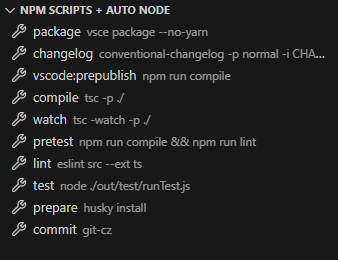

<h1 align="center">npm-scripts-auto-node</h1>

<div align="center">
<strong>
<samp>

English | [简体中文](README.zh-Hans.md)

</samp>
</strong>
</div>

## Marketplace
[Visual Studio Marketplace](https://marketplace.visualstudio.com/items?itemName=shilim.npm-scripts-auto-node)

## Usage

### create node.config.json in project root path
it will auto execute this script before running npm scripts
```json
{
  "script": "nodist 14.21.3"
}
```

## ChangeLog

[ChangeLog](./CHANGELOG.md)

## Preview


## License

[License MIT](./LICENSE)