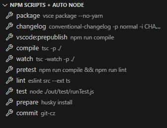

<h1 align="center">npm-scripts-auto-node</h1>

<div align="center">
<strong>
<samp>

[English](README.md) | 简体中文

</samp>
</strong>
</div>

## 插件市场
[Visual Studio Marketplace](https://marketplace.visualstudio.com/items?itemName=shilim.npm-scripts-auto-node)

## 使用

### 在项目根目录创建 node.config.json
执行npm脚本时会自动执行该script
```json
{
  "script": "nodist 14.21.3"
}
```

## 预览


## 更新日志

[ChangeLog](./CHANGELOG.md)

## 开源协议

[License MIT](./LICENSE)